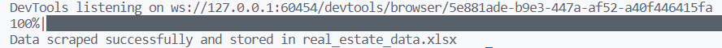
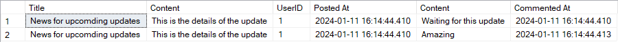

# Works on the Take-home Assignment

This is my work for the five tasks of the Take-home Assignment including the following contents:

- Task 1 - `Task1`: Python Programming
- Task 2 - `Task2`: Data Structures: E-commerce Inventory Schema
- Task 3 - `Task3`: Web Scraping - Real Estate Data
- Task 4 - `Task4`: Nested Set Model Implementation
- Task 5 - `Task5`: Database and SQL - Stored Procedure Creation

## Requirements & Installation

The programming is run and tested in the following environments:

- Python 3.11.6
- Windows 10
- Chrome (version 120.0.6099.217) for web driver in Task 3

Use the package manager [pip](https://pip.pypa.io/en/stable/) to install packages from the `requirements.txt`.

```bash
pip install -r requirements.txt
```

## Instructions

### Task 1

The data for this task can be found in `Task1/data.csv`. The solution is implemented in the `main.py`. Run the following command to execute the program.

```bash
cd Task1
python main.py
```

Expected output:

    42.55882352941177

### Task 2

The relationships among entities can be found in the image `Task2/ERD_ECommerceInventory.png`. The `Task2/ERD_ECommerce Inventory.vpp` contains the source diagram and can be opened in [visual paradigm](https://www.visual-paradigm.com/download/).

The `database.sql` contains the SQL code to create tables for the E-Commerce Inventory System which can be executed in [SQL Server Management Studio](https://learn.microsoft.com/en-us/sql/ssms/download-sql-server-management-studio-ssms?view=sql-server-ver16).

### Task 3

This program will scrape real estate data from this [website](https://batdongsan.com.vn/). The result is stored in the Excel file `Task3/real_estate_data.xlsx`.

Since the website blocks strange access to scrape the data, this program uses Chrome web driver from [selenium](https://pypi.org/project/selenium/) to stimulate access from a browser. The cache mechanism implemented is [lru_cache](https://docs.python.org/3/library/functools.html) to optimize scraping speed.

The default limit of pages to scrape in the program is 10 for each type of estate. To scrape all real estate data from the website, you can remove the `limit_page_num` parameter in `line 105` of the `Task3/main.py`.

Run the following command to execute the program.

```bash
cd Task3
python main.py
```

Expected output:


### Task 4

This program implements the nested set model. It contains functions to create nested set model and retrieve parent-child relationships.

The `Task4` folder contains the following file to do the task.

- `node.py`: Include the definition of the class of node for the tree
- `nested_set.py`: Include the definition of the class of the nested set model and necessary operations
- `main.py`: Include the script to test the implementation

Run the following command to execute the program.

```bash
cd Task4
python main.py
```

Expected output:

    Parent: 1, children: [2, 3, 4, 5]
    Parent: 5, children: [6, 7]
    Parent: 7, children: [8, 9]

### Task 5

The `Task5` folder contains the following file to do the task.

- `database.sql`: Include the SQL code to create tables (`User`, `Post`, and `Comment`) to manage the blog posts
- `StoredProcedure.sql`: Include the SQL code to create the stored procedure named `ManagePosts` containing blog post management operations and enhance functionality.

The stored procedure `ManagePosts` can perform the following actions.

- `addPost`: Add a new post
- `getPost`: Get post based on `PostID`
- `editPost`: Modify post based on `PostID`
- `deletePost`: Delete post based on `PostID`
- `addComment`: Add a new comment
- `getComment`: Get comments based on `PostID` and `UserID`
- `editComment`: Modify comment based on `CommentID`
- `deleteComment`: Modify comment based on `CommentID`
- `fetchPostRelatedData`: Fetching post-related data based on `PostID`

These files can be executed in [SQL Server Management Studio](https://learn.microsoft.com/en-us/sql/ssms/download-sql-server-management-studio-ssms?view=sql-server-ver16).

Expected output:

